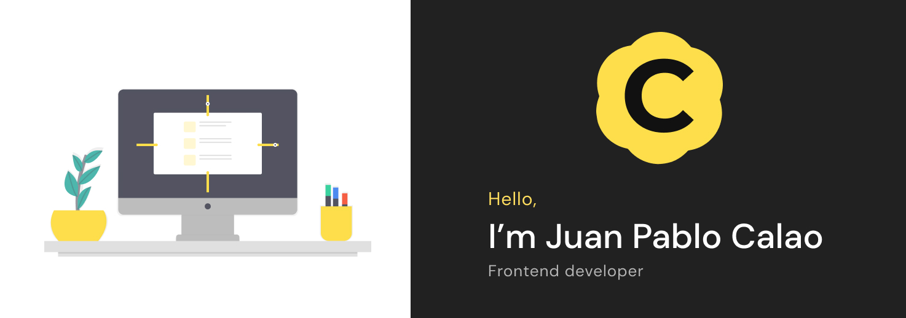

Welcome to my GitHub. I am a Frontend Developer using React JS, HTML, CSS, and JavaScript. I don't just write code, but I have a keen eye for understanding clients' business models in order to develop the best solution for end-users. Highly passionate about learning, teaching, and collaborating in teams. I like good designs and good user experience. Native Spanish speaker with an English working proficiency. You can find more about me on [my personal website calaojuanpablo.com](https://calaojuanpablo.com/).

### 📚 I am currently learning
- Next.JS
- More Javascript
- Design Patterns
- Web Design
- Figma
- Typescript

### 👨‍💻 My current work
I work in growth team of [Simetrik (YC W18)](https://simetrik.com/), leading the development of the website, responsible of all the important integrations for the team, and the headless CMS for the blog.

### 👱‍♂️ More about me
- I am musician, and my main instrument is the electric guitar 🎸.
- I also play drums and piano.
- I love reading, and I try to do it every morning.
- I like to run around the city.
- I am a youth leader in a local church.
- I studied Industrial Engineer, but switched to Software Development in 2017 (about 6 month after graduated).

### ☕️ Get in touch
- Website: [calaojuanpablo.com](https://calaojuanpablo.com/)
- LinkedIn: [CalaoJuanPablo](https://www.linkedin.com/in/calaojuanpablo/)
- Twitter: [@CalaoJuanPablo](https://twitter.com/CalaoJuanPablo)

Also fell free to email me at [me@calaojuanpablo.com](mailto:me@calaojuanpablo.com)